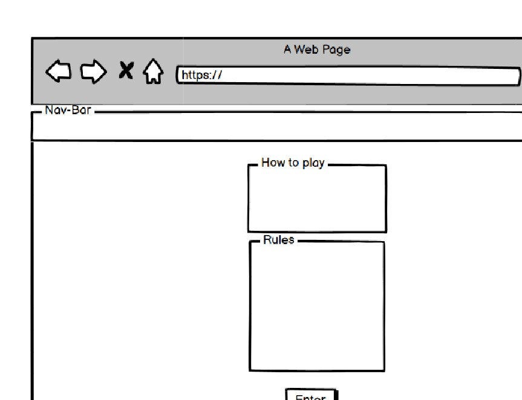

# **GameZone**
## **Site Overview**
This site is my first real introduction to world of javascript in the form a game of rock, paper, scissors, lizard, spock game. The site, inspired by 80's, 90's retro gaming has a very simple flow and design to it. It opens with on a landing page, allowing the user to have their first interaction. On this page, they can read about rules of the game and more importantly how to enter and play. Once they decide to enter, they will be alerted by pop up, reminding them to choose their difficulty level (to which there are three settings) to commence the game. On the game page, once the user has selected their difficulty preference the game will commence. The user will select form a choice of 5 inputs, the computer will simultaneously select their choice through the beautiful form of logic. The game will then map each users choice, decide who won the round, track the score and ultimatly decide who won the game through another alert. This alert will also inform the user who to restart the game. There is also an exit button, in the form of a rules button that will direct the user back to the main page. The header holds a simple text displaying the name of the game while the footer holds an anchor tag, directing ths user to follow on the creaters github page. 

-add table of contents later. 

## **Planning stage**
### **Target Audiences:**
* Users looking for a cool, fun retro game. 
* Users who like games of chance.
* Users who like challenging games.

### **User Stories:**
* As a user, I want to know how to start the game. 
* As a user, I want to know how to play the game. 
* As a user, I want the controls to be simplistic and intuitive. 
* As a user, I was to be able have fun with the game.  

### **Site Aims:**
* To include pattern matching functionality. 
* To provide a limited number of tries before a game is over. 
* To offer a score tracking system.
* To offer the ability to play against the computer.
* To offer the user a way to commence the game.
* To offer the user a way to end the game.
* To offer the user a to follow the creater for additional content.

### **How Is This Will Be Achieved:**
* The landing page will give the user the oppertunity to learn how to play the game. It also alerts the user to the rules of the game, it provides easy access to the game through a button. 

* Alerts are used to provide the user with content, informing them about how to play, if they won, loss, drew and ultimatly if declares who won the game outright. It will also exlain how to reset the game and or return to home screen. 

* The site provides a link to the developers github page. 

### **Wireframes:**
To aid with the design stage, I used wireframes. After my last project, I really wanted to focus on mobile first as I lost a lot of time resizing. Both layouts are the same. 
* Mobile Wireframes:
    * 
    * 

### **Color Scheme:**
When deciding the color scheme, I decided I wanted to go with an 80's / 90's retro arcadey feel. I liked the yellow and black, reminded me of pacman. 

## **Current Features Common to all pages**
###  **Custom Scroll Bar**
The default scroll bar was getting lost in the black and was making navigation difficult on the page. A custom scroll bar was implemented to avoid this allowing for a more user friendly UX.

#### *Title:*

* The title is nice and bright with an arcadey feel, it states the name of the game. 

#### *Footer:*

* The footer follows the same styling as the header, only it has a follow me link that links the user to the developers git hub. 

## **Typography**
* Throughout the page, there are three fonts used:
  * Press Start 2P - For all subheadings, game display text and buttons. 
  * Bungee Shade - For all text in Navbar and Footer. 
  * Times New Roman - For UL and OL and paragraph on main page.

## **Individual Page Content features**
### **Landing Page:**

* This page explains to the user how to play the game, where to click and the rules of the game. 
* is an anchor tag, developed into a clickable button which increases in size on hoover. When the user clicks this button they will enter the game area. 

### **Game Page:**
* Includes an conatiner to hold the game. This area includes interactive buttons the user can select. First the user must select there difficulty level, once selected the game will commence. The user can make their selection and the computer will make its own. 

* Game buttons include font awesome icons along with text explaing what each button is. 

* Includes a reset button, this refreshes the entire page, resarting the game. 

* Includes an anchor tag, this navigates the user back to the main page. 

* Includes a display area, using Javascript to manipulate the DOM and display the results, user and computer selections.

* Includes 3 x buttons so user can select their difficulty level. 

## **Future-Enhancements**

* I have not decided on any future enhancements for this site. This site was developed to meet project objectives and to display my level and understanding of Javascript today. 

