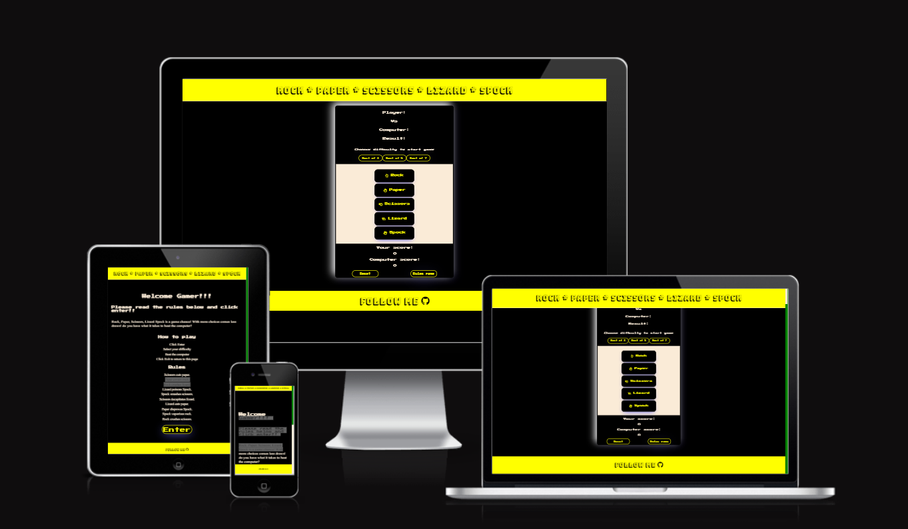

# **GameZone**
## **Site Overview**
This site is my first real introduction to world of javascript in the form a game of rock, paper, scissors, lizard, spock game. The site, inspired by 80's, 90's retro gaming has a very simple flow and design to it. It opens with on a landing page, allowing the user to have their first interaction. On this page, they can read about rules of the game and more importantly how to enter and play. Once they decide to enter, they will be alerted by pop up, reminding them to choose their difficulty level (to which there are three settings) to commence the game. On the game page, once the user has selected their difficulty preference the game will commence. The user will select form a choice of 5 inputs, the computer will simultaneously select their choice through the beautiful form of logic. The game will then map each users choice, decide who won the round, track the score and ultimatly decide who won the game through another alert. This alert will also inform the user who to restart the game. There is also an exit button, in the form of a rules button that will direct the user back to the main page. The header holds a simple text displaying the name of the game while the footer holds an anchor tag, directing ths user to follow on the creaters github page. 

## Table of contents:
1. [**Site Overview**](#site-overview)
1. [**Planning stage**](#planning-stage)
    * [***Target Audiences***](#target-audiences)
    * [***User Stories***](#user-stories)
    * [***Site Aims***](#site-aims)
    * [***How Is This Will Be Achieved:***](#how-is-this-will-be-achieved)
    * [***Wireframes***](#wireframes)
    * [***Color Scheme***](#color-scheme)
1. [**Current Features Common to all pages**](#current-features-common-to-all-pages)
    * [***Custom Scroll Bar:***](#custom-scroll-bar)
    * [***Title***](#title)
    * [***Footer***](#footer)
     * [**Typography**](#typography)
1. [**Individual Page Content features**](#individual-page-content-features)
    * [**Landing page:**](#landing-page)
    * [**Game page**](#game-page)
1. [**Future-Enhancements**](#future-enhancements)
1. [**Testing Phase**](#testing-phase)
* [**During Development Testing**](#during-development-testing)
    * [*Manual Testing*](#manual-testing)
    * [*Bugs and Fixes*](#bugs-and-fixes)
* [**Post Development Testing**](#post-development-testing)
  * [**Validators**](#validators)
      * [*HTML*](#html---httpsvalidatorw3orgnu)
      * [*CSS*](#css---httpsjigsaww3orgcss-validator)
       * [*JS*](#js---https://jshint.com/)
  * [**Lighthouse Scores**](#lighthouse-scores)
      * [*Desktop Version:*](#desktop-version)
1. [**Deployment**](#deployment)
1. [**Credits**](#credits)
    * [**Honorable mentions**](#honorable-mentions)
    * [**General reference**](#general-reference)
    * [**Content**](#content)

## **Planning stage**
### **Target Audiences:**
* Users looking for a cool, fun retro game. 
* Users who like games of chance.
* Users who like challenging games.

### **User Stories:**
* As a user, I want to know how to start the game. 
* As a user, I want to know how to play the game. 
* As a user, I want the controls to be simplistic and intuitive. 
* As a user, I was to be able have fun with the game.  

### **Site Aims:**
* To include pattern matching functionality. 
* To provide a limited number of tries before a game is over. 
* To offer a score tracking system.
* To offer the ability to play against the computer.
* To offer the user a way to commence the game.
* To offer the user a way to end the game.
* To offer the user a to follow the creater for additional content.

### **How Is This Will Be Achieved:**
* The landing page will give the user the oppertunity to learn how to play the game. It also alerts the user to the rules of the game, it provides easy access to the game through a button. 

* Alerts are used to provide the user with content, informing them about how to play, if they won, loss, drew and ultimatly if declares who won the game outright. It will also exlain how to reset the game and or return to home screen. 

* The site provides a link to the developers github page. 

### **Wireframes:**
To aid with the design stage, I used wireframes. After my last project, I really wanted to focus on mobile first as I lost a lot of time resizing. Both layouts are the same. 
* Mobile Wireframes:
    * 
    * 

### **Color Scheme:**
When deciding the color scheme, I decided I wanted to go with an 80's / 90's retro arcadey feel. I liked the yellow and black, reminded me of pacman. 

## **Current Features Common to all pages**
###  **Custom Scroll Bar**
The default scroll bar was getting lost in the black and was making navigation difficult on the page. A custom scroll bar was implemented to avoid this allowing for a more user friendly UX.

#### *Title:*

* The title is nice and bright with an arcadey feel, it states the name of the game. 

#### *Footer:*

* The footer follows the same styling as the header, only it has a follow me link that links the user to the developers git hub. 

## **Typography**
* Throughout the page, there are three fonts used:
  * Press Start 2P - For all subheadings, game display text and buttons. 
  * Bungee Shade - For all text in Navbar and Footer. 
  * Times New Roman - For UL and OL and paragraph on main page.

## **Individual Page Content features**
### **Landing Page:**

* This page explains to the user how to play the game, where to click and the rules of the game. 
* is an anchor tag, developed into a clickable button which increases in size on hoover. When the user clicks this button they will enter the game area. 

### **Game Page:**
* Includes an conatiner to hold the game. This area includes interactive buttons the user can select. First the user must select there difficulty level, once selected the game will commence. The user can make their selection and the computer will make its own. 

* Game buttons include font awesome icons along with text explaing what each button is. 

* Includes a reset button, this refreshes the entire page, resarting the game. 

* Includes an anchor tag, this navigates the user back to the main page. 

* Includes a display area, using Javascript to manipulate the DOM and display the results, user and computer selections.

* Includes 3 x buttons so user can select their difficulty level. 

## **Future-Enhancements**

* I have not decided on any future enhancements for this site. This site was developed to meet project objectives and to display my level and understanding of Javascript today. 

## **Testing Phase**

## **During Development Testing**
During the development process, I manually tested in the following ways:-

1. Using live server, an extension in VS Code, I manually checked, viewed the code live. I also used other tools such a Dev tools to check for responsiveness. 
    
2. After publishing the page on Github, I shared with a few a friends to test and share their feedback.

### ***Manual Testing:***
* To test for cross browers compatability I used three browers, two desktop and one mobile.

  1. Chrome
  2. Firefox  
  3. Samsung Mobile

* Using devtools, I set the responsiveness of the page from 320px to 4000px  to simulate different screen sizes. 
* I also checked on my own mobile device and asked friends and collegues to do the same on theirs. 

### ***Bugs and Fixes:***

## **Post Development Testing**

To help identify the bugs throughout this project, I used the VS Code extension to mannualy test throughout. Below is a list of some of the bugs and solutions to same that I came across. 

1. **Intended Outcome** - A footer that covers with the width of the page at all widths.
    * ***Issue Found:*** 
        * The footer kept rising from the bottom and moving in from the right
    * ***Solution Used:*** 
        * Used CSS  to set witdh to 110% and set fixed position.
1. **Intended Outcome** - A Reset button that resets player & computers score and restarts the game.
    * ***Issue Found:*** 
        * the function created seemed to keep causing bugs, it was not reseting corectly. 
    * ***Solution Used:*** 
        * Deleted the function, added and inline script on the html element to reload page on click. 
1. **Intended Outcome** - When the game ends .
    * ***Issue Found:*** 
        * the function created seemed to keep causing bugs, it was not reseting corectly. 
    * ***Solution Used:*** 
        * Deleted the function, added and inline script on the html element to reload page on click. 
1. **Intended Outcome** - To set the difficulty.
    * ***Issue Found:*** 
        * The functions created would not run, if they did run, they were creating more bugs.  
    * ***Solution Used:*** 
        * Deployed the functions on click in the html elements. 
1. **Intended Outcome** - Declaring a winner .
    * ***Issue Found:*** 
        * the IF function created using == (loose equality) sometimes returned the wrong values. 
    * ***Solution Used:*** 
        *Deleted == and replaced it with === (strict equality) it solved the issue. 
1. **Intended Outcome** - declare winner .
    * ***Issue Found:*** 
        * My function was unable to read the fontawesome icon and buged out. 
    * ***Solution Used:*** 
        * I added text so I could retrieve the data that way. 

## **Post Development Testing**
### **Validators**

#### ***HTML*** - https://validator.w3.org/nu/
  * Document checking completed. No errors or warnings to show. Both pages. 

#### ***CSS*** - https://jigsaw.w3.org/css-validator/

* All pages tested, no issues found via URL.

#### ***JS*** - https://jshint.com/
 *issue found:unused declared variables and missing semi colons. These were corrected. The other warnings, when I checked on other forums, they seemed to not affect this project. 

  

### **Lighthouse Scores**
### **Test conditions**
* I completed the lighthouse tests in incognito mode to avoid interference from browser extensions. 
* I ran the tests for desktop. 
#### ***Desktop Version:***
I have only included one screenshot for desktop as I would happy with the result and do not know how to improve on them just yet. 

 
  

## **Deployment**
To deploy my project on Github, I followed the following instructions: -

1. From the project's [repository](## **Deployment**
I deployed the page on GitHub pages via the following procedure: -

1. From the project's [repository](https://github.com/addieoG/Rock-Paper-Scissors-Lizard-Spock-Game), go to the **Settings** tab.
2. From the left-hand menu, select the **Pages** tab.
3. Under the **Branch** section, select the **Main** branch from the drop-down menu and click **Save**.
4. A message will be displayed to indicate a successful deployment to GitHub pages and provide the live link.

You  can find the live site via the following URL - [GameZone](https://addieog.github.io/Rock-Paper-Scissors-Lizard-Spock-Game/index.html))

## **Credits**
### **Honorable mentions**
A huge thank you to the following people, whom without, this project would never have been completed. 

* [Daisy Mc Girr](https://github.com/Daisy-McG) - Thank you Daisy, you took me on when you already had a full work load, provided some great insights and new tips and tools. You really helped me get over the line with this one. 
* [David Bowers](https://github.com/dnlbowers) - an absolute gent and a scholar. Although I missed him on this project through my own fault and not booking on time, he made every effort to ensure I was well taken care off and in the wonderful hands with the great Daisy Mc Girr

### **General reference:**
* The project is influenced by Code Institutes project called Love Maths, I have tried to take what I have learned and applied it with own deviation.  
* I relied upon W3schools, MDN web docs and youtube for references throughout the project. 
* Other influences came from [Bro Code](https://www.youtube.com/watch?v=n1_vHArDBRA) and [Beautiful CSS buttons examples](https://getcssscan.com/css-buttons-examples).

### **Content:**
* All content was written and designed by myself. 
* Icons in the footer were taken from [Font Awesome](https://fontawesome.com)

