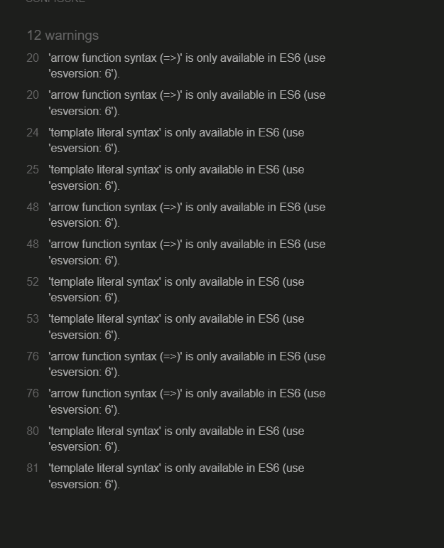

# Testing Page Table of Contents
* [**During Development Testing**](#during-development-testing)
    * [*Manual Testing*](#manual-testing)
    * [*Bugs and Fixes*](#bugs-and-fixes)
* [**Post Development Testing**](#post-development-testing)
  * [**Validators**](#validators)
      * [*HTML*](#html---httpsvalidatorw3orgnu)
      * [*CSS*](#css---httpsjigsaww3orgcss-validator)
  * [**Lighthouse Scores**](#lighthouse-scores)
      * [*Desktop Version:*](#desktop-version)
      * [*Mobile Version*](#mobile-version)

## **During Development Testing**
During the development process, I manually tested in the following ways:-

1. Using live server, an extension in VS Code, I manually checked, viewed the code live. I also used other tools such a Dev tools to check for responsiveness. 
    
2. After publishing the page on Github, I shared with a few a friends to test and share their feedback.

### ***Manual Testing:***
* To test for cross browers compatability I used three browers, two desktop and one mobile.

  1. Chrome
  2. Firefox  
  3. Samsung Mobile

* Using devtools, I set the responsiveness of the page from 320px to 4000px  to simulate different screen sizes. 
* I also checked on my own mobile device and asked friends and collegues to do the same on theirs. 

### ***Bugs and Fixes:***

## **Post Development Testing**

To help identify the bugs throughout this project, I used the VS Code extension to mannualy test throughout. Below is a list of some of the bugs and solutions to same that I came across. 

1. **Intended Outcome** - A footer that covers with the width of the page at all widths.
    * ***Issue Found:*** 
        * The footer kept rising from the bottom and moving in from the right
    * ***Solution Used:*** 
        * Used CSS  to set witdh to 110% and set fixed position.
1. **Intended Outcome** - A Reset button that resets player & computers score and restarts the game.
    * ***Issue Found:*** 
        * the function created seemed to keep causing bugs, it was not reseting corectly. 
    * ***Solution Used:*** 
        * Deleted the function, added and inline script on the html element to reload page on click. 
1. **Intended Outcome** - When the game ends .
    * ***Issue Found:*** 
        * the function created seemed to keep causing bugs, it was not reseting corectly. 
    * ***Solution Used:*** 
        * Deleted the function, added and inline script on the html element to reload page on click. 
1. **Intended Outcome** - To set the difficulty.
    * ***Issue Found:*** 
        * The functions created would not run, if they did run, they were creating more bugs.  
    * ***Solution Used:*** 
        * Deployed the functions on click in the html elements. 
1. **Intended Outcome** - Declaring a winner .
    * ***Issue Found:*** 
        * the IF function created using == (loose equality) sometimes returned the wrong values. 
    * ***Solution Used:*** 
        *Deleted == and replaced it with === (strict equality) it solved the issue. 
1. **Intended Outcome** - declare winner .
    * ***Issue Found:*** 
        * My function was unable to read the fontawesome icon and buged out. 
    * ***Solution Used:*** 
        * I added text so I could retrieve the data that way. 

## **Post Development Testing**
### **Validators**

#### ***HTML*** - https://validator.w3.org/nu/
  * Document checking completed. No errors or warnings to show. Both pages. 

#### ***CSS*** - https://jigsaw.w3.org/css-validator/

* All pages tested, no issues found via URL.

#### ***JS*** - https://jshint.com/
 *issue found:unused declared variables and missing semi colons. These were corrected. The other warnings, when I checked on other forums, they seemed to not affect this project. 

  

### **Lighthouse Scores**
### **Test conditions**
* I completed the lighthouse tests in incognito mode to avoid interference from browser extensions. 
* I ran the tests for desktop. 
#### ***Desktop Version:***
I have only included one screenshot for desktop as I would happy with the result and do not know how to improve on them just yet. 

 
  
